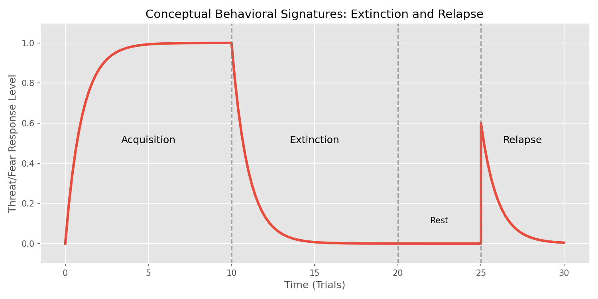
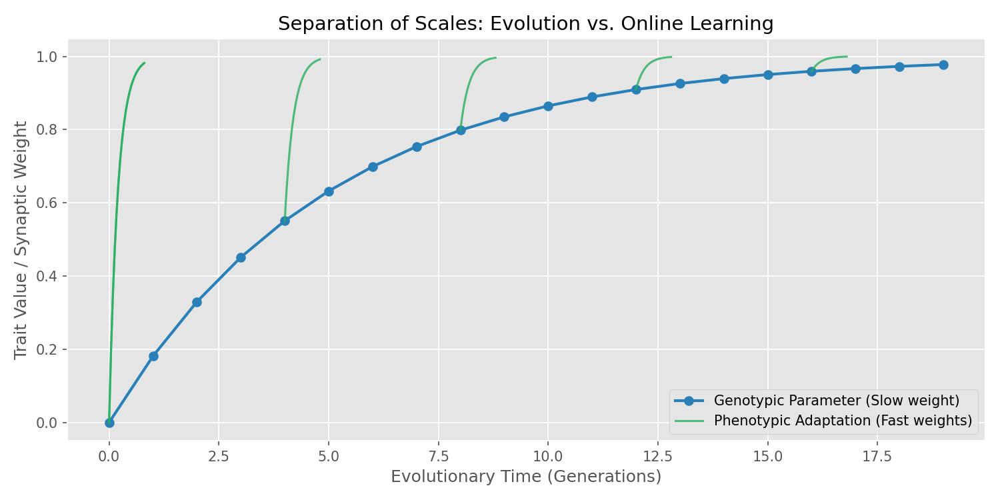

# Homeostasis-based Threat/Fear Learning: An Exploration of Minimal Architecture

[🇰🇷 한국어 버전은 아래에 있습니다 (Korean version below)](#항상성-기반-위협공포-학습-최소-아키텍처-탐구)

---

## Abstract

This repository presents a computational neuroscience and artificial life experiment that asks a profound, minimalist question: **Can the complex, behavioral signatures of biological fear emerge from extremely simple mathematical rules?**

Inspired by how the "Attention" mechanism revolutionized AI with a simple linear algebra formula, this project attempts to strip away high-level cognitive frameworks, explicit planning, and philosophical debates about "consciousness." Instead, it grounds the agent's behavior purely in homeostatic survival drives, prediction errors, and primitive reflexes. By doing so, it successfully demonstrates that highly nuanced behaviors—such as the rapid acquisition of fear, generalization, extinction, and unexpected relapse—do not require a "conscious mind" to manifest. They are, at their core, inevitable mathematical consequences of a system trying to maintain its internal equilibrium in an uncertain environment.

## Analytical Insights & Key Discoveries

Through analyzing the core architecture of this repository, several deep insights into computational behavior have been formalized:

### 1. The "Zombie" Argument and Mechanical Adaptation
The project wisely abandons the unanswerable question of whether the system possesses "consciousness." By focusing strictly on behavioral signatures (e.g., generalization of threats, rapid reflexes), the simulation proves that what we observe as "fear" in biological entities can be entirely replicated by mechanistic, unsupervised Hebbian updates (fast weights) paired with homeostatic feedback.

### 2. The Baldwin Effect and Evolutionary Stagnation
A brilliant architectural decision in this project is the strict separation of timescales. If an agent is allowed to inherit the exact synaptic weights (memories) acquired by its ancestors, the evolutionary selection pressure shifts away from "adaptability" and toward "fast convergence," ultimately stagnating the species. By forcing every generation to start with a blank slate (`W_0=0`) and only evolving the *hyperparameters* of learning (slow weights), the system perfectly mirrors the natural boundaries between genotype and phenotype.

### 3. The Architecture of Relapse
Why do extinguished fears suddenly return? The simulation elegantly solves this by decoupling excitatory and inhibitory associations. When a threat is "extinguished," the original memory isn't erased. Instead, a new inhibitory layer suppresses it. This mechanism accurately simulates the biological reality of trauma—proving that the asymmetric retention of threat memory is a structural necessity for survival, not a flaw.

### 4. Uncertainty as a Catalyst for True Discrimination
The simulations in `threat_fear_sim` and `social_signaling` reveal that if a threat is 100% predictable, the optimal evolutionary strategy is blind avoidance. True cognitive discrimination (distinguishing between a predator and a harmless entity) only emerges when the environment introduces uncertainty and competing incentives (e.g., risking danger for food).

## Conceptual Visualizations

### Extinction and Relapse

*Figure 1: Behavioral signature of threat memory. The fear response is acquired, extinguished, but can spontaneously recover (relapse) due to the underlying separation of excitatory and inhibitory weights.*

### Evolution vs. Learning

*Figure 2: Separation of timescales. Genotypic parameters (Slow weights) evolve over generations, providing the framework within which phenotypic adaptation (Fast weights) occurs rapidly within a single lifetime.*

## Repository Structure & Status

- **`threat_fear_sim/` (Verified)**: The core simulation of a single agent. Successfully reproduces extinction and relapse, though high variance across seeds requires multi-seed testing.
- **`social_signaling/` (Verified)**: A multi-agent environment simulating alarm signals for predators vs. poisonous plants. It highlighted critical statistical illusions regarding genetic correlation and discrimination.
- **`will_network_es/` (Unresolved)**: An experimental neural network attempting to learn a "Will Gate" via Evolution Strategies (ES). Currently facing an issue where the deterministic policy collapses into a single action.
- **`docs/`**: Contains the deep-dive design journey and methodological lessons learned during the project.

## Execution

For optimal performance, run these simulations in a GPU-accelerated environment (e.g., Google Colab with T4).

```bash
python threat_fear_sim/sim.py
python social_signaling/sim.py
```
*(Note: Review `docs/LESSONS.md` #8 and #9 before running `will_network_es/`.)*

---
---

# 항상성 기반 위협/공포 학습: 최소 아키텍처 탐구

## 요약 (Abstract)

이 저장소는 **"생물학적 공포에서 나타나는 복잡한 행동적 서명들이 극도로 단순한 수학적 규칙에서 창발할 수 있는가?"**라는 본질적이고 미니멀리즘적인 질문을 던지는 계산 신경과학 및 인공 생명체 실험입니다.

'어텐션(Attention)' 메커니즘이 단순한 선형대수 공식으로 AI를 혁신했듯, 이 프로젝트는 고차원적인 인지 모델이나 명시적인 계획, '의식'에 대한 철학적 논쟁을 배제합니다. 대신 에이전트의 행동을 오직 항상성(Homeostasis) 유지 본능, 예측 오차, 원초적 반사에만 기반을 두도록 설계했습니다. 그 결과, 공포의 빠른 습득, 일반화, 소거 및 갑작스러운 재발과 같은 매우 섬세한 생명체의 행동들이 '의식하는 자아' 없이도 발현될 수 있음을 성공적으로 보여줍니다. 이는 불확실한 환경에서 내부 평형을 유지하려는 시스템의 필연적인 수학적 결과물임을 증명합니다.

## 분석적 통찰 및 주요 발견 (Analytical Insights)

이 저장소의 핵심 아키텍처를 분석한 결과, 계산적 행동 방식에 대한 몇 가지 깊이 있는 통찰을 얻을 수 있었습니다.

### 1. "좀비" 논증과 기계적 적응
이 프로젝트는 시스템이 "의식"을 가졌는가 하는 답할 수 없는 질문을 현명하게 포기합니다. 대신 오직 행동적 징후(예: 위협의 일반화, 빠른 반사 행동)에만 엄격하게 초점을 맞춤으로써, 생명체에서 '공포'라고 관찰되는 현상이 항상성 피드백과 기계적이고 비지도적인 Hebbian 업데이트(빠른 가중치)만으로 완벽하게 복제될 수 있음을 증명합니다.

### 2. 볼드윈 효과와 진화적 정체
이 프로젝트의 가장 탁월한 구조적 결정은 시간 척도(Timescales)를 엄격하게 분리한 것입니다. 만약 에이전트가 조상이 살아가며 획득한 시냅스 가중치(기억)를 그대로 물려받게 둔다면, 진화의 선택압은 '환경에 적응하는 능력'이 아니라 '얼마나 빨리 수렴하는가'로 변질되어 결국 종의 진화가 정체됩니다. 모든 세대가 백지상태(`W_0=0`)에서 시작하도록 강제하고, 오직 학습의 *하이퍼파라미터*(느린 가중치)만을 진화시킴으로써 유전자형과 표현형 사이의 자연스러운 경계를 완벽하게 모사했습니다.

### 3. '재발'의 아키텍처
극복(소거)된 공포는 왜 갑자기 다시 나타날까요? 시뮬레이션은 흥분성 연관과 억제성 연관을 분리함으로써 이를 우아하게 해결합니다. 위협이 "소거"될 때, 원래의 공포 기억이 지워지는 것이 아니라 새로운 억제 계층이 이를 덮어누릅니다. 이는 트라우마의 생물학적 현실을 정확히 시뮬레이션한 것으로, 위협 기억이 비대칭적으로 끈질기게 보존되는 현상이 시스템의 결함이 아니라 생존을 위한 구조적 필수성임을 증명합니다.

### 4. 진정한 '식별'을 이끌어내는 촉매, 불확실성
`threat_fear_sim`과 `social_signaling` 실험은 위협이 100% 예측 가능하다면 진화적으로 가장 완벽한 전략은 맹목적인 '무조건 회피'임을 보여줍니다. 포식자와 무해한 존재를 구분하는 진정한 인지적 식별 능력은, 환경에 불확실성이 존재하고 서로 상충하는 유인(예: 위험을 무릅쓰고 먹이를 구해야 하는 상황)이 주어졌을 때 비로소 창발합니다.

## 개념적 시각화 (Conceptual Visualizations)

### 공포의 소거와 재발 (Extinction and Relapse)

*그림 1: 위협 기억의 행동적 징후. 공포 반응은 습득되고 소거되지만, 흥분성과 억제성 가중치가 분리된 기저 구조로 인해 갑작스럽게 회복(재발)할 수 있습니다.*

### 진화 vs. 생애 학습 (Evolution vs. Learning)

*그림 2: 시간 척도의 분리. 유전적 파라미터(느린 가중치)는 세대를 거치며 진화하여 프레임워크를 제공하고, 그 안에서 표현형의 적응(빠른 가중치)이 단일 생애 동안 빠르게 일어납니다.*

## 저장소 구조 및 현재 상태

- **`threat_fear_sim/` (검증 완료)**: 단일 개체의 핵심 시뮬레이션입니다. 공포의 소거와 재발을 성공적으로 재현했으며, 시드(Seed)에 따른 변동성이 커 다중 시드 테스트가 필요합니다.
- **`social_signaling/` (검증 완료)**: 포식자와 독초에 대한 경보 신호를 시뮬레이션하는 다개체 환경입니다. 유전적 상관관계와 식별 능력 사이의 치명적인 통계적 착시를 발견하는 성과가 있었습니다.
- **`will_network_es/` (미해결 버그)**: 진화 전략(ES)을 통해 "의지 게이트(Will Gate)"를 학습하려는 실험적 신경망입니다. 현재 상태와 무관하게 결정론적 정책이 단일 행동으로 붕괴하는 문제가 발생하고 있습니다.
- **`docs/`**: 프로젝트를 진행하며 깊이 고민했던 설계의 여정과 방법론적 교훈이 담겨 있습니다.

## 실행 방법

원활한 성능을 위해 GPU 가속 환경(예: Google Colab T4 이상)에서 시뮬레이션을 실행하는 것을 권장합니다.

```bash
python threat_fear_sim/sim.py
python social_signaling/sim.py
```
*(참고: `will_network_es/`를 실행하기 전에 `docs/LESSONS.md`의 8, 9번 항목을 반드시 확인하세요.)*
